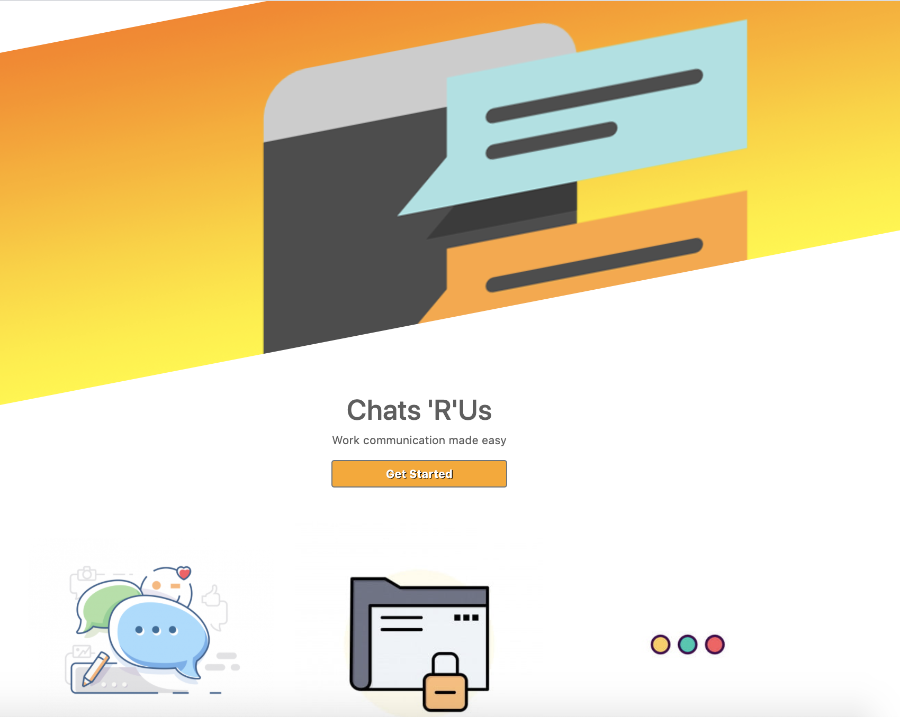

# Chats'R'Us 

## Table of Content:
1.[Deployment](#Deployment)

2.[Description](#Description)

3.[Screenshot](#Screenshot)

4.[User Story](#User-Story)

5.[Installation Instructions](#Installation-and-Usage)

6.[Technologies](#Technologies)

7.[License](#License)

8.[Collaborators](#Collaborators)

9.[LICENSE](#LICENSE)

## Deployment
https://group-3-project-2.herokuapp.com/

## Description
Chat ‘R’ Us is an application allows teams to communicate with each other both individually and as a group. You are able to see who is online in the chat room, previous messages. 

## Screenshot

## User Story
As a team leader,  I would like to have an online chat room which shows me who is online during work hours, save chat history to record team’s conversation so that I can communicate with my team and track conversation history effectively when we can’t have phone in the office and limited human contacts. 

## Installation and Usage
### Step 1
After cloning the repository in your local device, run <npm install> to install node modules in your local machine. Run <node server.js> to start the application locally in localhost 8080.

### Step 2
Sign up with your username, email address and password, it will redirect you to login page after creating account.

### Step 3
Log into the chat and chat with your colleages.

## Technologies 
* node.js
* express
* express-sessions
* sequelize
* socket.io
* javascript
* jquery
* handlebars 
* css
* passport 
* moment
* bcrypt
 

## Limmitation
Due to time constraint, there're more features to add, such as able to send notification after signing up, updating my own profile, and wishing to delete my account. 

## Collaborators
* [Laith Alwani](https://github.com/LaithAlwani)
* [Michelle](https://github.com/mich3ll3e)
* [Shawn Harvey](https://github.com/theharv1)

## LICENSE

